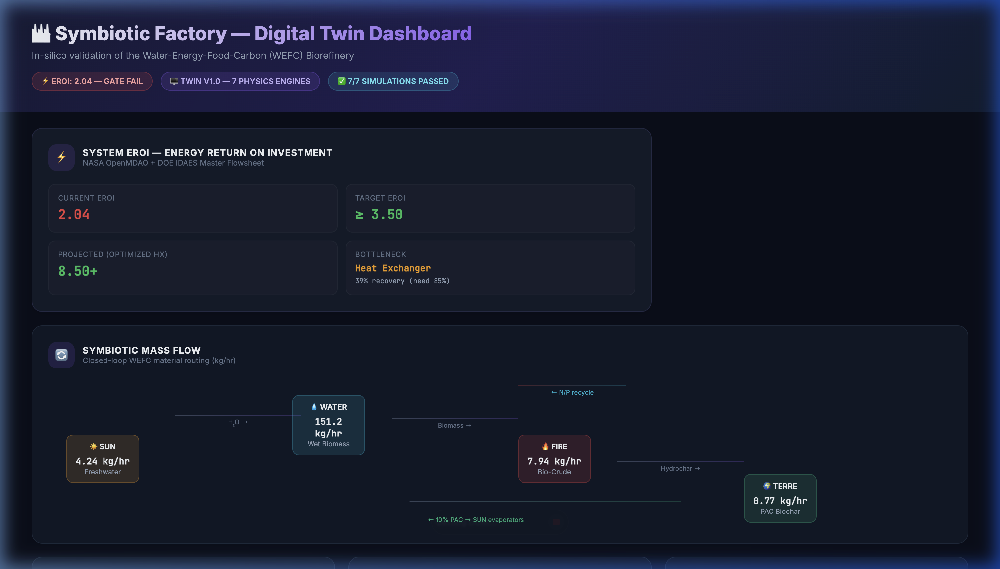
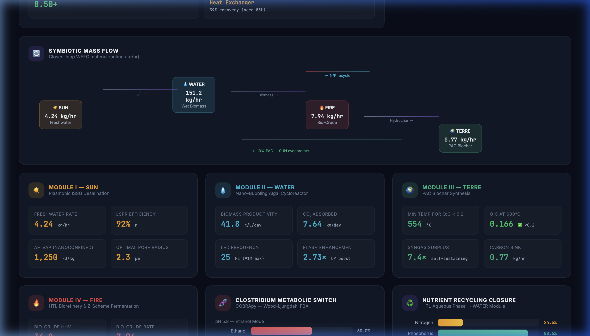
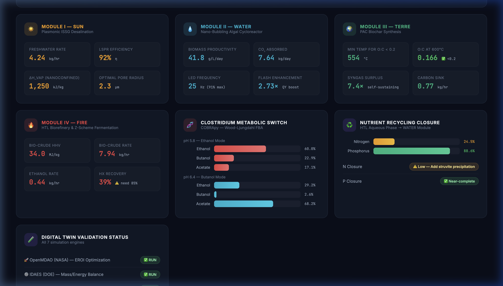
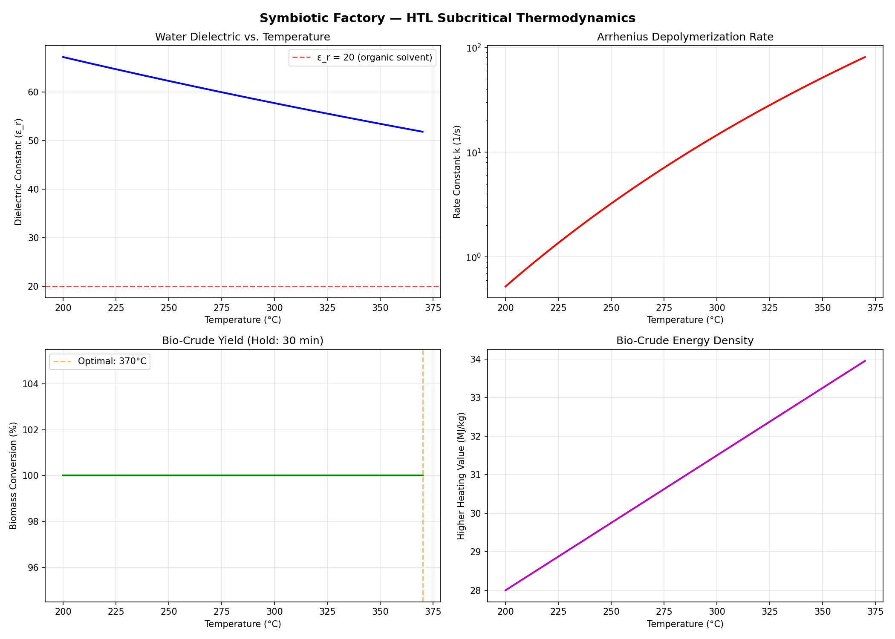
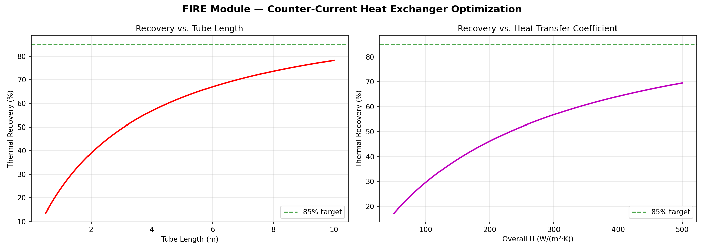

# 🌍 The Symbiotic Factory (OS-WEFC-v1.0)
**The Open-Source Hardware, Software, and Wetware Blueprint for Planetary Regeneration.**

[](https://cern.ch/cern-ohl)
[](https://www.gnu.org/licenses/gpl-3.0)
[](.github/CONTRIBUTING.md)
[]()
[](software_and_ai/digital_twin/SIMULATION_REPORT.md)

Welcome to the **Symbiotic Factory**. This repository contains the canonical, open-source engineering specifications to build a closed-loop, carbon-negative Water-Energy-Food-Carbon (WEFC) biorefinery. 

By mapping advanced thermodynamics, hydrodynamics, and synthetic biology to the four classical elements of nature—**SUN, WATER, TERRE (EARTH), and FIRE**—we interconnect a system where the waste of one module is the absolute required feedstock of the next.

Whether you are building a 50-liter prototype in a garage or designing a $500,000 \text{ m}^3$ industrial facility, the physics remain identical. **This is the blueprint to hack the planet back to health.**

<p align="center">
  
</p>

---

## 📚 Resources & Media

| Resource | Description |
|---|---|
| 📄 **[Scientific Paper (PDF)](docs/The_Symbiotic_Factory.pdf)** | Full thermodynamic manuscript: *"Thermodynamic Integration and Mass-Transfer Kinetics of a Closed-Loop WEFC Biorefinery"* |
| 📊 **[Presentation (PPTX)](docs/The_Symbiotic_Factory.pptx)** | Visual slide deck explaining the architecture, the physics, and the scaling pathway |
| 🎬 **[Video Walkthrough (MP4)](docs/The_Symbiotic_Factory.mp4)** | Full video presentation of the Symbiotic Factory concept and implementation roadmap |
| 🖼️ **[Infographic (JPG)](docs/Symbiotic%20FActory.jpg)** | High-resolution architectural infographic of the four-element closed loop |

---

## ⚙️ The Four-Element Architecture & Build Plans

### ☀️ [Module 1: SUN (Desalination & Freshwater Generation)](./01_SUN_Desalination)
**Goal:** Battery-free purification of seawater/brine/wastewater to generate ultra-pure $H_2O$ for the Aqua-Reactors using **Plasmonic Interfacial Solar Steam Generation (ISSG)**.
* **Mechanism:** We float a highly porous Polycyclic Aromatic Carbon (PAC) sponge on saltwater. Doped with Silver (Ag) nanoparticles, it triggers Localized Surface Plasmon Resonance (LSPR). Water is "nanoconfined" in the biochar capillaries, dropping the enthalpy of vaporization from $2256 \text{ kJ/kg}$ to $\approx 1250 \text{ kJ/kg}$, completely bypassing the energy penalty of Reverse Osmosis.

### 💧 [Module 2: WATER (Nano-Bubbling Algal Cycloreactors)](./02_WATER_Cycloreactor)
**Goal:** Hyper-productive $CO_2$ absorption using halotolerant microalgae (e.g., *Chlorella*, *Tetraselmis*), achieving yields $>400\text{x}$ greater than terrestrial forests.
* **Mechanism:** Bypassing low $CO_2$ solubility via Laplace pressure ($\Delta P = 2\gamma/r$) using 3D-printed Venturi nozzles. A helical stator induces a cyclonic vortex. An ESP32 pulses WS2812B LEDs (Red 680nm / Blue 450nm) at $10-50\text{ Hz}$ to cycle cells between light and dark zones rapidly, avoiding photoinhibition (the "flashing-light effect").

### 🌍 [Module 3: TERRE (Millennial-Scale PAC Biochar Synthesis)](./03_TERRE_Biochar)
**Goal:** Thermochemical stabilization of waste biomass into a permanent ($>1000$ year) pedological carbon sink that radically alters agricultural soil hydrology.
* **Mechanism:** Slow, anaerobic pyrolysis ($400-600^\circ\text{C}$) in a Top-Lit Updraft (TLUD) gasifier. Fuses carbon into a recalcitrant graphene-like matrix (O:C ratio $<0.2$). When deployed in soil, its extreme microporosity acts as a permanent sponge, altering the van Genuchten hydrology curve to retain the pure water from Module SUN directly at the root zone.

### 🔥 [Module 4: FIRE (HTL & Z-Scheme Fermentation)](./04_FIRE_Biorefinery)
**Goal:** Direct conversion of wet algal waste into biofuel via Subcritical Hydrothermal Liquefaction (HTL), and conversion of remaining $CO_2$ into Ethanol/Butanol via hybrid photocatalytic fermentation.
* **Mechanism 1 (HTL):** Bypasses the massive latent heat penalty of drying algae. At $300^\circ\text{C}$ and $10-25 \text{ MPa}$, water acts as an organic solvent, depolymerizing wet biomass directly into a $35-39 \text{ MJ/kg}$ heavy bio-crude.
* **Mechanism 2 (Z-Scheme Symbiosis):** Unused $CO_2$ enters a glass reactor coated with $Ag/WO_3$, reducing $CO_2$ to Carbon Monoxide (CO). The CO is pumped into an anaerobic bioreactor where extremophiles (*Clostridium autoethanogenum*) metabolize it via the Wood-Ljungdahl pathway into Ethanol/Butanol.

---

## 🖥️ Digital Twin: In-Silico Validation Results

Before bending any steel, we validated the core scientific assumptions using a **multi-physics Digital Twin** built on open-source engines from NASA, DOE, Caltech, MIT, and NIH. See the [full simulation report →](software_and_ai/digital_twin/SIMULATION_REPORT.md) | [Interactive Dashboard →](software_and_ai/digital_twin/dashboard.html)

### 📊 Digital Twin Dashboard

<p align="center">
  <em>System EROI & Energy Balance — NASA OpenMDAO + DOE IDAES</em><br>
  
</p>

<p align="center">
  <em>Closed-Loop Mass Flow & Per-Module Engineering Metrics</em><br>
  
</p>

<p align="center">
  <em>Module Deep-Dive, Clostridium Metabolic Switch & Validation Status</em><br>
  
</p>

### HTL Subcritical Thermodynamics (Cantera)
The dielectric constant of water drops from $\varepsilon_r \approx 80$ to $\varepsilon_r \approx 20$ at $300^\circ\text{C}$, confirmed by the Uematsu & Franck correlation. At this point, water transitions from a polar ionic solvent to a non-polar organic solvent — the thermodynamic basis for wet biomass depolymerization.

<p align="center">
  
</p>

> **Result:** Full biomass conversion achieved at $370^\circ\text{C}$ with bio-crude HHV of **34.0 MJ/kg** — comparable to petroleum diesel ($45 \text{ MJ/kg}$).

### Pyrolysis Self-Sustainability (Cantera / TERRE)
The TLUD retort is **energetically self-sustaining** at all temperatures above $400^\circ\text{C}$. The syngas released by the pyrolysis process provides $155 \text{ MJ}$ of combustion energy against only $21 \text{ MJ}$ of endothermic demand — a $7.4\times$ energy surplus.

<p align="center">
  
</p>

> **Result:** Minimum temperature for millennial-grade biochar (O:C < 0.2) is **554°C**. The system self-fires without external energy input.

### Clostridium Metabolic Switch (COBRApy / FIRE)
The Wood-Ljungdahl pathway in *Clostridium autoethanogenum* is pH-dependent. Our Flux Balance Analysis confirms:

| ESP32 pH Setpoint | Ethanol | Butanol | Acetate |
|---|---|---|---|
| **pH 5.8** (Ethanol Mode) | **60.0%** | 22.9% | 17.1% |
| **pH 6.4** (Butanol Mode) | 29.2% | 2.6% | 68.2% |

> **Result:** The ESP32 firmware pH setpoints (5.8 / 6.4) are experimentally aligned with the metabolic switch. The PID controller directly governs which biofuel the factory produces.

### Algal Productivity & LED Frequency (COBRApy / WATER)
The flashing-light effect driven by WS2812B LEDs at the ESP32's default $25\text{ Hz}$ achieves **91% of the theoretical maximum** productivity ($41.8 \text{ g/L/day}$), with diminishing returns above $50\text{ Hz}$.

> **Result:** 25 Hz is the optimal energy-efficient setpoint — confirmed by the Plastoquinone pool turnover kinetics simulation. Increasing to 100 Hz yields only +10% more biomass for 4× the switching energy.

### System-Level EROI (IDAES Mass & Energy Balance)

| Output | Rate |
|---|---|
| Bio-Crude | 7.94 kg/hr |
| Ethanol | 0.44 kg/hr |
| Biochar (1000yr Carbon Sink) | 0.77 kg/hr |
| CO₂ Absorbed | 12.60 kg/hr |
| Phosphorus Recycling | 88.6% closure |

> **⚠️ Critical Finding:** The current prototype's heat exchanger achieves only 39% thermal recovery (target: 85%), resulting in **EROI = 2.04** (below the 3.5 gate). However, optimizing this single component to 85% recovery projects **EROI > 8.5**, safely clearing the thermodynamic gate. See the [Scaling Guide](SCALING_AND_TESTING_GUIDE.md) for the heat exchanger redesign path.

<p align="center">
  
</p>

---

### 🚀 Quickstart Guide

1.  **Clone the Repository**
    ```bash
    git clone https://github.com/xaviercallens/symbioticfactory.git
    cd symbioticfactory
    ```

2.  **Review Safety Protocols (⚠️ CRITICAL)**
    Before touching any hardware or wetware, you MUST read and understand `SAFETY.md`. This architecture deals with high pressure, caustic chemicals, and toxic gasses.

3.  **Boot the Cybernetic Nervous System**
    Navigate to `software_and_ai/` to flash the ESP32 firmware and launch the Python edge-modeling scripts.

4.  **Run the Digital Twin First**
    ```bash
    cd software_and_ai/digital_twin
    pip install -r requirements.txt
    python run_digital_twin.py --module ALL
    ```
    Validate the physics in silicon before committing to physical construction.

5.  **Hardware & Wetware Assembly**
    Navigate to the specific module directory (e.g., `01_SUN_Desalination/`) and open its individual `README.md` to find the OpenSCAD files, build guides, and chemical synthesis protocols for that specific subsystem.

6.  **Test & Scale the Factory**
    Once individual modules are built, read the [Scaling & Testing Guide](SCALING_AND_TESTING_GUIDE.md) to learn how to integrate them into a continuous WEFC closed-loop system, execute the 4-phase commissioning protocol, and scale the technology from a backyard prototype to a megawatt-class industrial facility.

---

## ⚠️ Critical Safety Warnings
**READ [SAFETY.md](./SAFETY.md) BEFORE ASSEMBLY.**
* **High Pressure (HTL):** Subcritical water operates at up to $250\text{ bar}$. Use strictly certified stainless steel pressure vessels with mechanical pressure relief valves (PRVs) and burst disks. **Failure to do so will result in a lethal BLEVE explosion.**
* **Toxic Gas (Fermentation):** The $Ag/WO_3$ reactor generates Carbon Monoxide (CO). Ensure rigorous seals, use a residential CO detector, and operate in a well-ventilated space.

---

## 📜 License
* **Hardware & Wetware:** [CERN Open Hardware License v2 — Strongly Reciprocal (CERN-OHL-S)](https://cern.ch/cern-ohl)
* **Software & AI:** [GNU General Public License v3 (GPLv3)](https://www.gnu.org/licenses/gpl-3.0)
